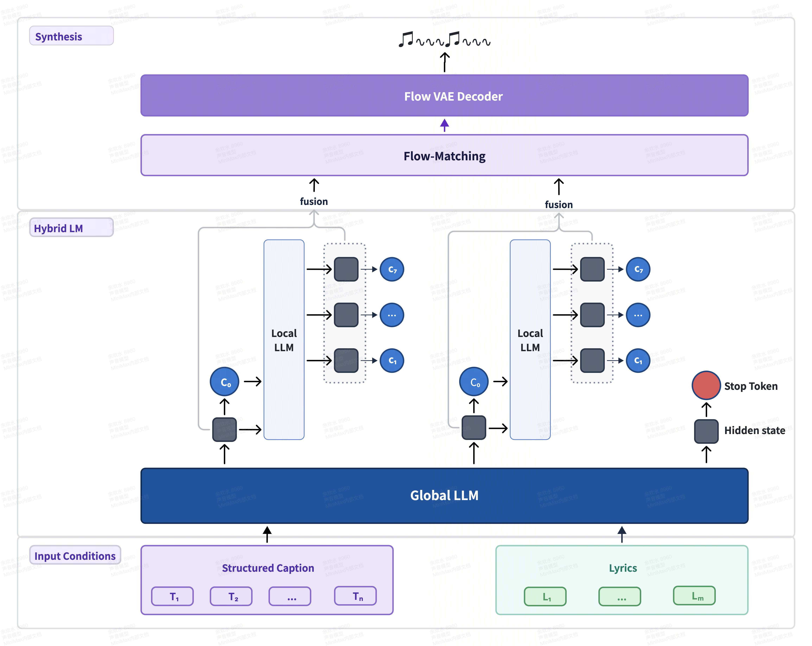

<div align="center">
  
</div>
<p align="center">
  <a href="https://agent.minimax.io/" target="_blank"></a>
  <a href="https://platform.minimax.io/docs/guides/text-generation" target="_blank"></a>
  <a href="https://www.minimax.io" target="_blank"></a>
  <br>
  <a href="https://modelscope.cn/organization/minimax" target="_blank" rel="noopener noreferrer"></a>
  <a href="https://platform.minimaxi.com/docs/faq/contact-us" target="_blank"></a>
  <a href="https://discord.com/invite/DPC4AHFCBw" target="_blank"></a>
  <a href="https://huggingface.co/MiniMaxAI" target="_blank"></a>
  <a href="https://github.com/MiniMax-AI/MiniMax-Music3" target="_blank"></a>
  <a href="https://huggingface.co/MiniMaxAI/MiniMax-Music3/blob/main/LICENSE" target="_blank"></a>
</p>

# MiniMax Music 3

**MiniMax Music 3** is a high-performance music generation model for creating complete songs up to **five minutes** long. Conditioned on lyrics and a detailed music description, it generates structurally coherent songs with expressive vocals, evolving arrangements, and stable long-form audio quality.

MiniMax Music 3 combines an **8B Global LLM** for long-range musical structure, a **0.6B Local LLM** for frame-level acoustic detail, and a continuous hidden-state synthesis system based on **Flow Matching** and **Flow-VAE**. The model produces 32 kHz, 16-bit stereo WAV audio.

<p align="center">
  
</p>

## Complete Songs with Long-Range Coherence

MiniMax Music 3 natively supports full-song generation up to five minutes. The model maintains musical themes, rhythm, vocal identity, and arrangement progression across long sequences, enabling complete structures such as intro, verse, pre-chorus, chorus, bridge, instrumental break, and outro.

## Fine-Grained Music Control

The model accepts two complementary inputs:

- **Lyrics** define the words to be sung and may include explicit section tags such as `[Intro]`, `[Verse]`, `[Pre-Chorus]`, `[Chorus]`, `[Post-Chorus]`, `[Bridge]`, `[Instrumental]`, `[Solo]`, and `[Outro]`.
- **Music description** defines the musical style, emotional progression, vocal performance, instrumentation, arrangement, and production profile.

For precise control, we recommend using a Structured Caption with three sections:

- **Global Metadata**: genre, subgenre, BPM, key, scale, emotional progression, listening scenario, and production profile.
- **Vocal Details**: vocal gender, timbre, performance style, harmony, backing vocals, and vocal effects.
- **Arrangement**: primary and secondary instruments, section-level instrument evolution, groove, bass, percussion, textures, and spatial effects.

This representation allows the model to follow not only a global style, but also the musical development of the song over time.

## Hybrid-LM

MiniMax Music 3 uses a hierarchical autoregressive architecture that separates global musical modeling from local acoustic modeling.

- The **Global LLM (8B)** predicts the first RVQ codebook frame by frame and models the song's long-range semantic and structural progression.
- The **Local LLM (0.6B)** predicts the remaining acoustic codebooks within each frame and restores fine-grained acoustic information.

The Global LLM is initialized from Qwen3-8B. During training, its embedding and output layers are first adapted to semantic music tokens. The Global and Local LLMs are then jointly trained to model all RVQ codebooks.

## Continuous Hidden-State Synthesis

Instead of decoding only from discrete RVQ tokens, the synthesis module fuses the final hidden states of the Global and Local LLMs. These continuous representations preserve richer acoustic information for vocal articulation, instrumental texture, and temporal continuity.

The synthesis path is:

```text
Global and Local LLM hidden states
                ↓
       Hidden-state fusion
                ↓
     Flow Matching (2.4B)
                ↓
        Flow-VAE latent
                ↓
    Flow-VAE Decoder (123M)
                ↓
       32 kHz stereo audio
```

The Flow-VAE architecture is adapted from MiniMax Speech and retrained for the dynamic range and spectral characteristics of music.

## Music Tokenizer

The training tokenizer uses eight layers of Residual Vector Quantization (RVQ):

- The first semantic codebook contains **16,384** entries and captures the core musical semantics and structure.
- The remaining seven acoustic codebooks contain **1,024** entries each and represent residual acoustic details.

Training first optimizes the semantic codebook, then jointly trains all eight codebooks. At inference time, waveform synthesis uses the fused LLM hidden states and does not require the discrete tokenizer decoder.

## How to Use

### Download the Model

```bash
hf download MiniMaxAI/MiniMax-Music3 --local-dir /path/to/minimax_ttm
```

### Serve with SGLang-Omni

MiniMax Music 3 is currently supported by [SGLang-Omni](https://github.com/sgl-project/sglang-omni). From the SGLang-Omni repository root, run:

```bash
python -m sglang_omni.cli serve \
  --config examples/configs/minimax_ttm.yaml \
  --model-path /path/to/minimax_ttm \
  --host 127.0.0.1 \
  --port 8000
```

Inference uses two CUDA GPUs:

- **GPU 0** runs Qwen3 and eight-codebook RVQ autoregressive generation.
- **GPU 1** runs Flow Matching and DAV waveform decoding.

### Generate Music

The service uses the shared speech API. Put the lyrics in `input` and the music description in `instructions`.

```bash
curl http://127.0.0.1:8000/v1/audio/speech \
  -H 'Content-Type: application/json' \
  -d '{
    "model": "minimax_ttm",
    "input": "[Verse]\nMorning light filtering through the pine\n[Chorus]\nSoftly the world begins to breathe",
    "instructions": "A warm acoustic pop song with intimate female vocals, fingerpicked guitar, soft piano, and a gradual emotional build into a wide final chorus.",
    "response_format": "wav",
    "seed": 7,
    "max_new_tokens": 9000,
    "stream": false
  }' \
  --output minimax_music3.wav
```

An example generated with this checkpoint is available at [`assets/minimax_ttm.wav`](assets/minimax_ttm.wav).

## Prompt Enhancement

A concise natural-language description can be used directly. For more detailed control, it can be expanded into a Structured Caption containing `Global Metadata`, `Vocal Details`, and `Arrangement`. Musical instructions attached to lyric section tags should be preserved in the arrangement description, while the lyric text itself remains in the lyrics input.

## Limitations

- Inference requires two CUDA GPUs.
- Only non-streaming generation is currently supported.
- The tokenized text prompt is limited to 5,000 tokens.
- Audio generation is limited to 9,000 acoustic frames.
- Section tags and music descriptions provide generative control rather than strict symbolic guarantees. The generated tempo, key, instrumentation, lyrics, and song structure may not always match every requested detail exactly.

## Contact Us

Contact us at [model@minimax.io](mailto:model@minimax.io).
